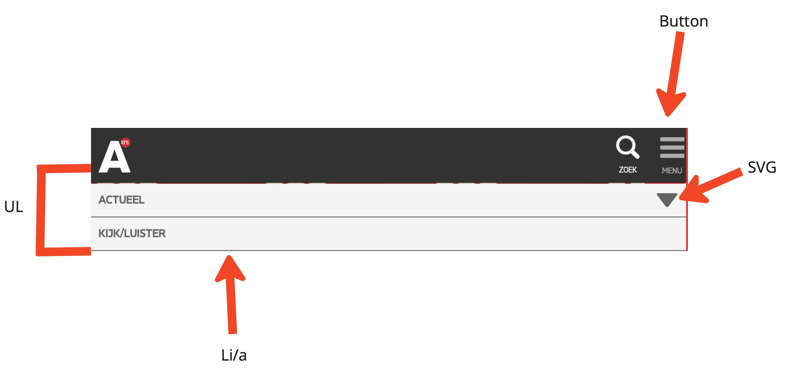
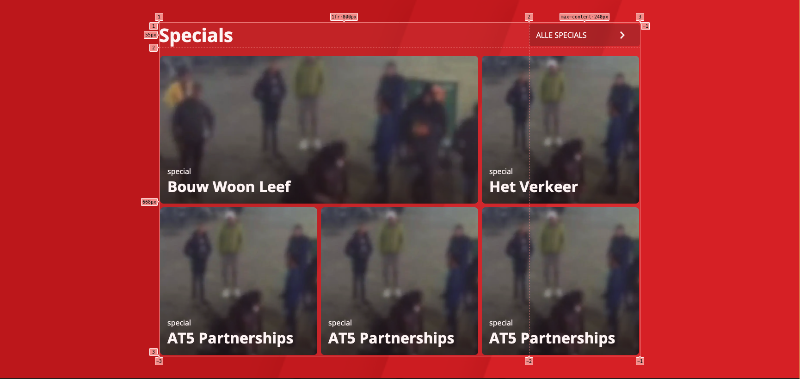
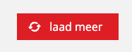

# Procesverslag
Markdown is een simpele manier om HTML te schrijven.  
Markdown cheat cheet: [Hulp bij het schrijven van Markdown](https://github.com/adam-p/markdown-here/wiki/Markdown-Cheatsheet).

Nb. De standaardstructuur en de spartaanse opmaak van de README.md zijn helemaal prima. Het gaat om de inhoud van je procesverslag. Besteedt de tijd voor pracht en praal aan je website.

Nb. Door *open* toe te voegen aan een *details* element kun je deze standaard open zetten. Fijn om dat steeds voor de relevante stuk(ken) te doen.

## Jij

  
uitwerken voor kick-off werkgroep

  ### Auteur:
  Sanne 't Hooft (Jean-Carlos De Leon Vitiello)

  #### Je startniveau:
  hier je startniveau (Blauw)

  #### Je focus:
  hier je focus (responsive)
 

## Je website

  
uitwerken voor kick-off werkgroep

  ### Je opdracht:
  https://www.at5.nl

  #### Screenshot(s) van de eerste pagina (small screen): 
  Home page
  

  #### Screenshot(s) van de tweede pagina (small screen):
  detail page 
  
 

## Toegankelijkheidstest 1/2 (week 1)

  
uitwerken na test in 2e werkgroep

  ### Bevindingen
  - de meeste titels zijn H1
  - er zitten veel errors
  - screen reader skipt de knop actueel.
  - at5 gebruikjt de standaard browser focus state

## Breakdownschets (week 1)

  
uitwerken na afloop 3e werkgroep

  ### de hele pagina: 
  

  ### dynamisch deel (bijv menu): 
  

## Voortgang 1 (week 2)

  
uitwerken voor 1e voortgang

  ### Stand van zaken
  

  ### Agenda voor meeting
  samen met je groepje opstellen

  | Jean-Carlo     | Mila               | Teun         | philene          |
  | ---            | ---                | ---          | ---              |
  | HTML/CSS       | hoe maak je gebruik|              |                  |
  | Checken        |van screenreader.   | afwezig      | afwezig          |
  |positionabsolute| Github uploaden    |              |                  |
   grid              werkt niet.

  ### Verslag van meeting
  hier na afloop snel de uitkomsten van de meeting vastleggen

  - Ik moet letten op de volgorde van mijn html eerst de htjes en dan de ptjes
  - meer wit ruimte tussen codes om het overzichtelijk te houden
  - ruim de code op die niet gebruikt worden.
  - gebruik order om de h2 onder de P te krijgen
  - de screenreader vraag is uiteindelijk niet gesteld.

## Voortgang 2 (week 3)

  
uitwerken voor 2e voortgang

  ### Stand van zaken
  hier dit ging goed & dit was lastig (neem ook screenshots op van delen van je website en code)

  ### Agenda voor meeting
  samen met je groepje opstellen

  | Jean-c  1      | student 2          | student 3    | student 4        |
  | ---            | ---                | ---          | ---              |
  | Grid uitleg    | en dit             | en ik dit    | en dan ik dat    |
  |                | dit als er tijd is | nog een punt | dit wil ik zeker |
  | ...            | ...                | ...          | ...              |

  ### Verslag van meeting
  hier na afloop snel de uitkomsten van de meeting vastleggen

  - Ik liep vast met de grid maar dat is door een beetje ermee te oefenen tijdens de meeting wel gelukt

## Toegankelijkheidstest 2/2 (week 4)

  
uitwerken na test in 9e werkgroep

  ### Bevindingen
  - ik heb de code voor de focus state toegevoegd in mijn css ookal gebruikt AT5 de standaard focus state. ik vond het nog te onduidelijk.
  - Ik moet de skip knop voor de screen reader nog toevoegen.
  - ik heb geen animaties in mijn ontwerp
  voor de rest werkte alles goed
  - ik had op sommige secties geen heading dus die heb ik nu toegevoegd.
  - contrast is overal goed en ik heb de dark modes toegevoegd.
  - skip toe content knop had ik nog niet dus die heb ik ook erbij gezet.
  alle afbeeldingen hebben een alt tekst.

## Voortgang 3 (week 4)

  
uitwerken voor 3e voortgang

  ### Stand van zaken
  de hamburger menu maken ging wel goed maar reageerde niet als ik erop klikte.
  

  ### Agenda voor meeting
  samen met je groepje opstellen

  | jean-c         | student 2          | student 3    | student 4        |
  | ---            | ---                | ---          | ---              |
  | hamburger menu | en dit             | en ik dit    | en dan ik dat    |
  | opent niet     | dit als er tijd is | nog een punt | dit wil ik zeker |
  | ...            | ...                | ...          | ...              |

  ### Verslag van meeting
  hier na afloop snel de uitkomsten van de meeting vastleggen

  - Inplaats van hoofdletters te typen in de html gebruik text transform uppercase om de tekst in hoofdletters te veranderen
  - de hamburger menu kon ik niet openen omdat de z-index te laag was waardoor er iets voor de knop stond.
  - de html ziet er goed uit en is semantisch correct 
  - snel beginnen met de tweede pagina anders ga ik het niet halen.

## Eindgesprek (week 5)

  
uitwerken voor eindgesprek

  ### Je uitkomst - karakteristiek screenshots:
  

  ### Dit ging goed/Heb ik geleerd: 
  De grid was in het begin heel lastig maar na een tijde ermee te werken heb ik het wel onder controlle. Ik vond het vooral handig hoe makkelijk je kan aangeven waar je een element wilt hebben door simpel de collumn en de row aan te geven. Dat is veel handiger dan de flexbox naar mijn mening. ook was het leren van responsive design heel handig en leerzaam.

  

  ### Dit was lastig/Is niet gelukt:
  At5 heeft een laad meer knop waarbij de SVG 360 grade draait wanneer je hoverd erop en wanneer je weer uit hoverd dan draait het terug. Ik kreeg de eerste draai aan de praat maar het draaide bij mij niet terug. Ik heb veel geprobeerd maar ik kwam er helaas niet uit waardoor ik het opgegeven.

  

## Bronnenlijst

  
continu bijhouden terwijl je werkt

  Nb. Wees specifiek ('css-tricks' als bron is bijv. niet specifiek genoeg). 
  Nb. ChatGpT en andere AI horen er ook bij.
  Nb. Vermeld de bronnen ook in je code.

  1. bron voor de toggle button: https://www.w3schools.com/howto/howto_css_switch.asp
  2. https://www.at5.nl/ voor afbeeldingen, linear gradient en de svg
  3. https://chatgpt.com voor de opasity van de linear gradient 
  4. https://developer.mozilla.org/en-US/docs/Web/HTML/Element/time voor de time element uitleg
  5. https://www.a11yproject.com/posts/how-to-hide-content/ om content te verstoppen

